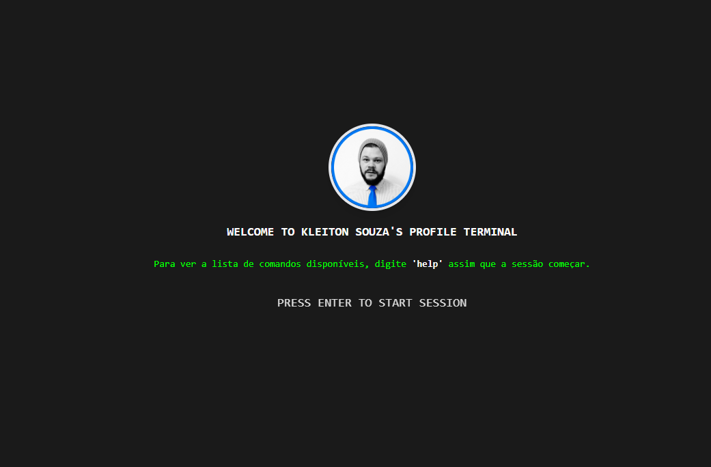

# Kleiton Souza - Profile Terminal

Um terminal interativo de perfil pessoal, desenvolvido em React + Vite, inspirado em interfaces de terminal para apresentar informações profissionais de forma moderna e dinâmica.

## Demonstração



## Funcionalidades
- Tela inicial com boas-vindas e logo
- Ícone de terminal no header e favicon
- Comandos interativos simulando um terminal real
- Exibição de informações profissionais, skills, projetos, experiência, certificados e contato
- Suporte a temas (dark/light)

## Tecnologias Utilizadas
- React
- TypeScript
- Vite
- TailwindCSS

## Estrutura do Projeto
```
├── components/
│   ├── StartScreen.tsx
│   ├── Terminal.tsx
│   └── ThemeSwitcher.tsx
├── contexts/
│   └── ThemeContext.tsx
├── App.tsx
├── constants.ts
├── types.ts
├── index.tsx
├── index.html
├── vite.config.ts
└── ...
```

## Como rodar localmente
1. Clone o repositório:
   ```sh
   git clone <url-do-repo>
   ```
2. Instale as dependências:
   ```sh
   npm install
   ```
3. Rode o projeto:
   ```sh
   npm run dev
   ```
4. Acesse em `http://localhost:5173` (ou porta indicada no terminal)

## Build para produção
```sh
npm run build
```

## Contato
- Email: kleiton.ads@hotmail.com
- LinkedIn: https://www.linkedin.com/in/kleitonsouzaads/
- GitHub: https://github.com/kleitonADS/

---
Desenvolvido por Kleiton Souza 🚀
